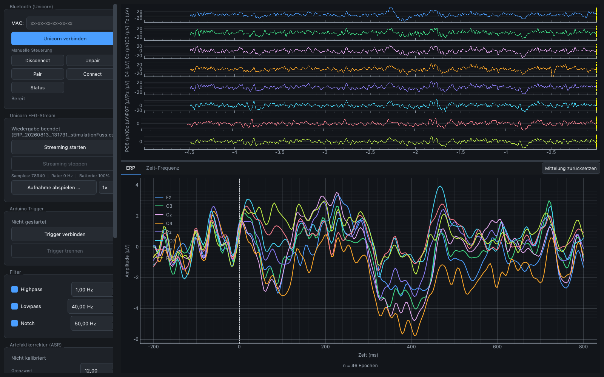
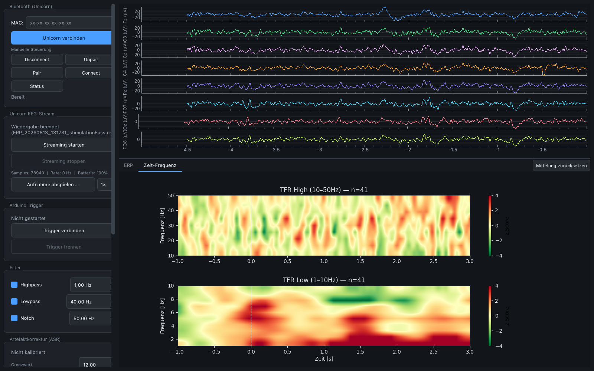
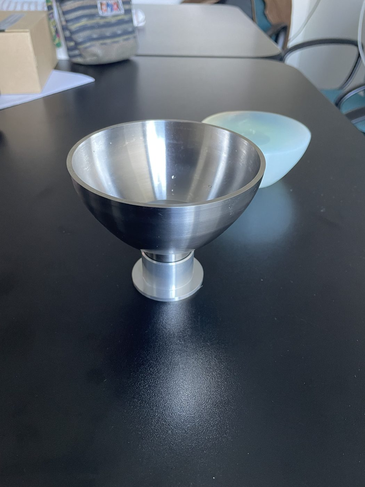
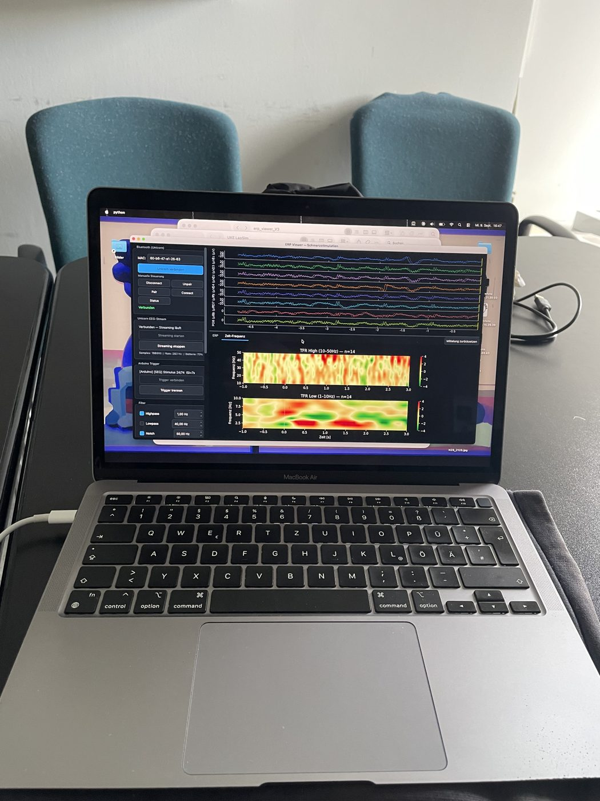

<p align="center">
  
</p>

<p align="center">
  <a href="https://github.com/FelixKuon/ERPulse/actions/workflows/ci.yml"></a>
  
  
  <a href="LICENSE"></a>
</p>

**ERPulse** zeigt dir ereigniskorrelierte Potenziale (ERPs) *live* – während die Messung läuft.
EEG-Rohsignal, gemittelte Reizantwort und Zeit-Frequenz-Analyse in einem Fenster, gespeist von einem
[g.tec Unicorn Hybrid Black](https://www.unicorn-bi.com/) (8 Kanäle, 250 Hz, Bluetooth) und einem
Arduino, der die Reizzeitpunkte als Trigger liefert. Dazu ein Offline-Werkzeugkasten, mit dem sich
dieselbe Aufnahme hinterher sauber (nullphasig gefiltert, mit Statistik) auswerten lässt.

> *Live ERP & time-frequency viewer for the g.tec Unicorn Hybrid Black EEG, with Arduino triggers and an
> offline analysis toolkit. UI and documentation are in German.*

<p align="center">
  
</p>

## Was kann es?

| | |
|---|---|
| **Live-Rohsignal** | 8 Kanäle (Fz, C3, Cz, C4, Pz, PO7, Oz, PO8) mit gleichmäßigem Scrollen, trotz Bluetooth-Paketbündelung (Zeitachse aus dem Sample-Zähler des Geräts rekonstruiert, Paketverluste werden interpoliert) |
| **Echtzeit-Filter** | Hochpass, Tiefpass, Notch (50 Hz), fortlaufend und mit Zustand |
| **ERP-Mittelung** | −200 … 800 ms um jeden Trigger, Artefaktgrenze in µV, laufender Mittelwert über alle akzeptierten Epochen |
| **Zeit-Frequenz** | Morlet-Wavelets (1–10 Hz und 10–50 Hz), z-Score gegen die Baseline |
| **ASR** | Artifact Subspace Reconstruction zur Online-Artefaktkorrektur (Kalibrierung per Knopfdruck) |
| **Aufnahme** | CSV (Roh + gefiltert + Trigger) und JSON (Metadaten, Ereignisse) pro Sitzung |
| **Replay** | Aufnahmen wie einen Live-Stream abspielen, **ohne Gerät** – ideal zum Ausprobieren |
| **Offline-Auswertung** | Nullphasen-Filter, robuste Triggerauswahl, Latenzmaße mit Bootstrap, Cluster-Permutationstest, Split-Half-Reliabilität (`offline/`) |

<p align="center">
  
</p>

## Schnellstart (ohne Hardware)

Du brauchst nur Python ≥ 3.9. Es liegt eine echte Beispielaufnahme bei.

```bash
git clone https://github.com/FelixKuon/ERPulse.git
cd ERPulse
python -m venv .venv
```

**macOS / Linux**
```bash
source .venv/bin/activate
pip install -r requirements.txt
python app.py
```

**Windows (PowerShell)**
```powershell
.venv\Scripts\Activate.ps1
pip install -r requirements.txt
python app.py
```

Oder einfach doppelklicken: `ERP Viewer starten.command` (macOS) bzw. `Start Windows.bat` (Windows) – die
legen beim ersten Start die Umgebung selbst an.

Im Programm: **„Aufnahme abspielen …“** → `examples/sample_recording/ERP_demo_stimulation.csv` wählen →
Tempo z. B. auf 8× stellen. Rohsignal, ERP und Zeit-Frequenz bauen sich wie bei einer echten Messung auf.

## Mit dem Unicorn messen

### Hardware

* g.tec **Unicorn Hybrid Black** (Bluetooth-Classic/SPP)
* optional: **Arduino UNO R4 WiFi** mit der Firmware aus [`firmware/trigger/`](firmware/trigger/README.md): löst die
  Reize aus und schickt pro Reiz eine Zeile `TRIGGER:<n>,<ms>` über USB (andere Boards gehen, wenn sie dieselbe Zeile senden)

### macOS

Das Programm koppelt den Unicorn selbst, über [`blueutil`](https://github.com/toy/blueutil):

```bash
brew install blueutil
```

MAC-Adresse des Geräts in `config_local.py` eintragen (siehe unten) und im Programm **„Unicorn verbinden“**
drücken (Disconnect → Unpair → Pair → Connect, das ist die einzige Sequenz, die auf macOS zuverlässig war).

### Windows

Windows koppelt selbst – das Programm sucht danach nur den entstandenen COM-Port.

1. Unicorn einschalten.
2. *Einstellungen › Bluetooth & Geräte › Gerät hinzufügen › Bluetooth* → **UN-…** wählen
   (falls eine PIN verlangt wird: siehe Unicorn-Handbuch).
3. In ERPulse **„Unicorn-Port suchen“** drücken, dann **„Streaming starten“**.

Findet die Suche den Port nicht, trag die MAC-Adresse oder den Port fest ein:

```python
# config_local.py  (liegt neben config.py, wird von Git ignoriert)
UNICORN_BLUETOOTH_MAC = "aa-bb-cc-dd-ee-ff"
UNICORN_PORT = "COM5"      # optional; im Geräte-Manager unter „Anschlüsse (COM & LPT)“
ARDUINO_PORT = "COM7"      # optional
```

> **Hinweis:** Die Windows-Unterstützung ist neu. Die Port-Erkennung ist per Unit-Test gegen typische
> Windows-Hardware-IDs abgesichert und die GUI läuft in CI unter Windows, getestet mit echtem Unicorn
> wurde bisher aber nur macOS. Erfahrungen und Issues sind willkommen.

## Offline-Auswertung

```python
from offline import load_session, OfflineFilter, replay, plot_erp, plot_tfr

ses = load_session("examples/sample_recording/ERP_demo_stimulation.csv")
eeg = OfflineFilter(fs=ses.fs).highpass(1.0).notch(50.0)(ses.raw)
res = replay(eeg, ses.trigger_idx, fs=ses.fs, drop_first=10)
plot_erp(res)
plot_tfr(res)
```

`replay()` treibt dieselben `ERPProcessor`/`TFRProcessor` an wie die Live-Anwendung – was die Oberfläche
zeigt und was das Notebook zeigt, kann nicht auseinanderlaufen. Fertige Abläufe stehen in
[`analyse_offline.ipynb`](analyse_offline.ipynb) (eine Sitzung) und
[`analyse_vergleich.ipynb`](analyse_vergleich.ipynb) (Bedingungen vergleichen; braucht die Original-Messdaten,
die nicht im Repo liegen – die Ergebnisse sind als Ausgabe im Notebook gespeichert).

## Hintergrund: Wofür wurde es gebaut?

ERPulse entstand in einem Projekt, das untersucht, ob sich somatosensorische/Schmerz-ERPs auf
Stoßwellen-Reize mit einem günstigen 8-Kanal-System nachweisen lassen – und ob man die
Leitungsgeschwindigkeit (Latenzunterschied zwischen Reizorten, z. B. Fuß vs. Oberarm) damit messen kann.

| Aufbau | |
|:--:|:--:|
|  |  |

Die Ergebnisse (und was sie **nicht** belegen) stehen ehrlich aufbereitet in
[`praesentation/README.md`](praesentation/README.md), die Abbildungen in `praesentation/hell` und
`praesentation/dunkel`. Kurzfassung: Die Verarbeitungskette ist über Messtage reproduzierbar und der
Effekt der akustischen Dämpfung ist klar nachweisbar; für Latenzunterschiede zwischen Körperstellen
reichen Auflösung und Epochenzahl bisher nicht. Der nächste sinnvolle Versuch (Bedingungen *innerhalb*
einer Aufnahme abwechseln) steht in der [Übergabe](HANDOVER.md#offene-punkte--nächste-schritte).

## Projektstruktur

```
app.py                  Einstiegspunkt
gui/                    PyQt6-Oberfläche (connection_dev_window.py = Hauptfenster)
core/                   Reader (Unicorn, Arduino, Replay), ERP/TFR/ASR, Aufnahme, Port-Suche
offline/                Auswertung: Laden, Filter, Triggerauswahl, Latenzmaße, Plots
utils/filters.py        Echtzeit-Filter
firmware/trigger/       Arduino-Firmware für die Reizsequenz und die Trigger
tests/                  Unit-Tests + GUI-Rauchtest
examples/               Beispielaufnahme
praesentation/          Abbildungen und Befunde
```

Der **Weg zum Weitermachen** (Architektur, Stolperfallen, offene Punkte) steht in
[HANDOVER.md](HANDOVER.md).

## Mitmachen

Issues und Pull Requests sind willkommen – besonders Berichte, ob es mit Windows-/Linux-Hardware läuft.
Tests: `pip install pytest && python -m pytest tests -q`.

## Lizenz

[MIT](LICENSE) © 2026 Felix Kuon. ERPulse ist ein unabhängiges Projekt und kein Produkt von g.tec.
